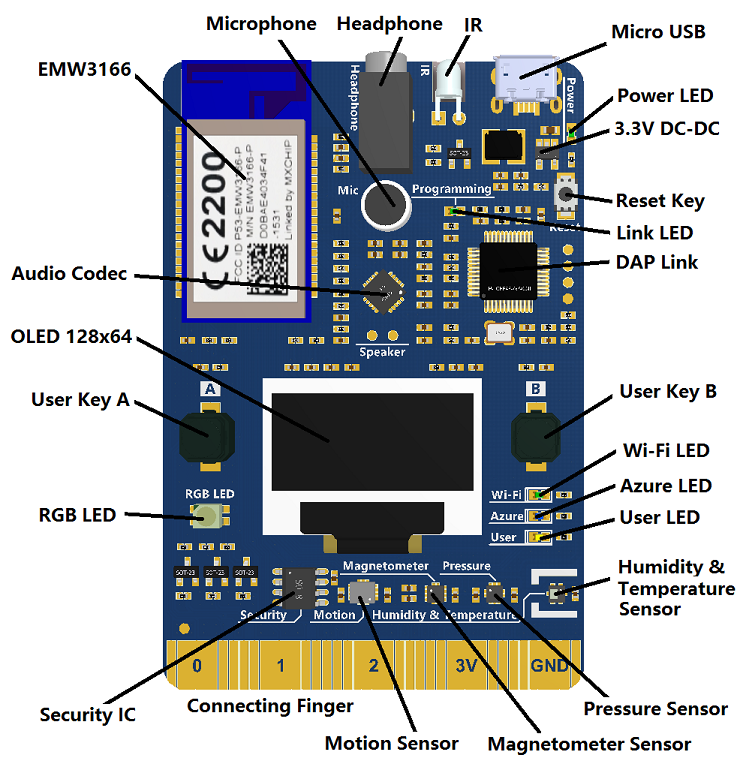

# Azure IoT Edge Hands On Labs - Module 1

## KNOW BEFORE YOU START

This module uses the [MXChip IoT DevKit](https://aka.ms/iot-devkit) device to provide sensor data. You can develop for it using both the standard Arduino IDE or the Visual Studio Code extension for Arduino.  With built in Wifi, OLED display, headphone, microphone, sensors like temperature, humidity, motionand  pressure, the [MXChip IoT DevKit](https://aka.ms/iot-devkit) makes it very easy to get started with Azure IoT projects.



There is also a version of this module based on the standard Arduino located [here](../README.md)

## Azure Portal Access

Because the Azure Streaming Analytics on Edge feature is in preview, to access the Azure Portal, use this specially formatted URL throughout the labs:

https://portal.azure.com/?Microsoft_Azure_StreamAnalytics_onedge=true

## Create an IoT Hub and an "Edge Device"

You can create an IoT hub using the following methods:

* The + New option opens the blade shown in the following screen shot. The steps for creating the IoT hub through this method and through the marketplace are identical.

* In the Marketplace, choose Create to open the blade shown in the following screen shot.

* Provide a name and a resource group. You can use a free tier but only one free tier is available per subscription.


While you are in the Azure portal, let's go ahead and grab a couple of important connection parameters and create an IoT Edge Device

In the IoT Hub blade of the Azure portal for your created IoT Hub, do the following:
* In the left-hand nav bar, click on "Shared Access Policies" and then click on "iothubowner", copy the "Connection String - Primary Key" string and paste it into Notepad.  We'll need it later.  This is your "IoTHub Owner Connection string" (keep that in mind, or make a note next to it in Notepad, we will use it in subsequent labs).  
* Close the "Shared Access Policy" blade

Now let's create the "edge device"
* In the left-hand nav bar, click on "IoT Edge (preview)"
* click "Add Edge Device"
* Give your IoT Edge Device a name and click "Create"
* once created, find the IoT Edge Device connection string (primary key) and copy/paste this into Notepad.  This is the "IoT Edge Device" connection string

## Create docker repository

IoT Edge modules are pulled by the Edge runtime from a docker containder image repository.  You can host one locally in your own network/infrastructure if you choose, Azure offers a [Container Registry service](https://azure.microsoft.com/en-us/services/container-registry/)  and of course, Docker themselves offer a repository (docker hub).  For simplicity, we will run the labs based off of hosting images using Azure Container Registry.  If you feel confident in doing so, feel free to leverage other docker image respositories instead if you wish.

### Create the repository

1. Sign in to the Azure portal at https://portal.azure.com

2. Create a container registry by clicking on:  Create a resource > Containers > Azure Container Registry.


3. Enter values for Registry name and Resource group. The registry name must be unique within Azure, and contain 5-50 alphanumeric characters. Create a new resource group named 'myResourceGroup' and for SKU, select 'Basic'. Then Select Create to deploy the ACR instance.


4. When the Deployment succeeded message appears, select the container registry in the portal, then select Access keys.


  Copy the Login server URI, username and password into notepad as you will need them later.

 Generally, docker images are referred to in a three part name:  \<respository>/image:tag where image is your image name, and tag is an optional "tag" you can use to have multiple images with the same name (often used for versioning).

## Clone the lab materials locally

The first step is to clone the lab materials locally (you'll need a few components of module2 locally to run).

```cmd
cd \
git clone https://github.com/toddwhitehead/azure-iot-edge-hol
```

## Additional setup

There are a few final steps needed to set up our specific lab scenario.  We are using our Edge device "as a gateway*, so we need:

1. Our IoT Device to be able to find it
2. Have valid certificates so the IoT Device will open a successful TLS connection to the Edge

First let's add a host file entry for our Edge device. This will let our "IoT Device" resolve and find our Edge gateway.  

* Open a command prompt __*as an Administrator*__
* Type the command bellow to open the hosts file in notepad
    ```
    notepad.exe c:\windows\system32\drivers\etc\hosts
    ```
* Add a row at the bottom with the following and then save and close the file
    ```
    127.0.0.1  mygateway.local
    ```
* Confirm you can successfully "ping mygateway.local"

Now let's create the certificates needed

* Open a PowerShell session __*as an Adminstrator*__ 

>Note: Do this in a plain Powershell window.  It does not work in the PowerShell ISE for some reason.

First, we will clone the Azure IoT C sdk.  We need this to get the certificate generation scripts.  Also, while Edge is in public preview, we need the 'modules-preview' branch of the SDK.

After cloning the C sdk, we prepare the PowerShell environment to we can generate the certificates.

Run the following commands from the root of the **"C" drive**

    cd \

    git clone -b modules-preview http://github.com/azure/azure-iot-sdk-c

## Download and Install IoT Edge service

Use PowerShell as administrator to download and install the IoT Edge runtime. Use the device connection string that you retrieved from IoT Hub to configure your device.

1. On your IoT Edge device, run PowerShell as an administrator.

2. On your IoT Edge device, run PowerShell as an administrator.

```cmd
. {Invoke-WebRequest -useb aka.ms/iotedge-win} | Invoke-Expression; `
Install-SecurityDaemon -Manual -ContainerOs Linux
```

3. When prompted for a DeviceConnectionString, provide the string that you copied in the previous section. Don't include quotes around the connection string. 

4. Check the status of the IoT Edge service.

5. Check the status of the IoT Edge service.

```cmd
Get-Service iotedge
```

6. Wait for a minute or two and then view all the modules running on your IoT Edge device. Since the service just started for the first time, you should only see the edgeAgent module running. The edgeAgent module runs by default, and helps to install and start any additional modules that you deploy to your device. 

```
iotedge list
```


__**Congratulations -- You now have an IoT Edge device up and running and ready to use**__

To continue with module 2, click [here](/module2)
