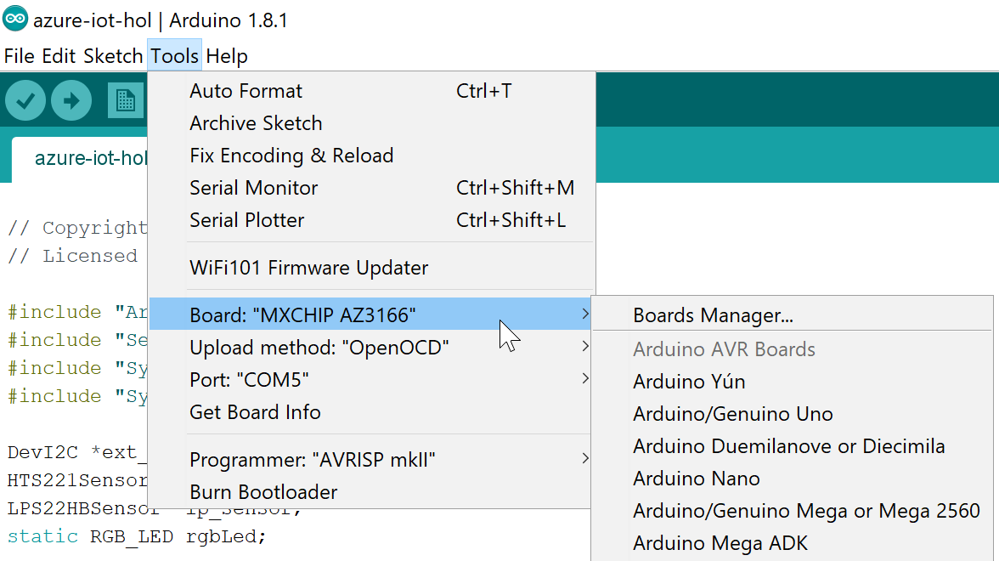
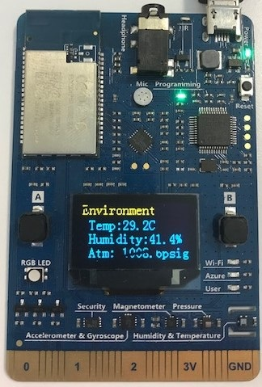

# Azure IoT Edge Hands On Labs - Module 2

Created and maintained by the Microsoft Azure IoT Global Black Belts

## KNOW BEFORE YOU START

This version of module2 uses the [MXChip IoT DevKit](https://aka.ms/iot-devkit) and .NET Core for our "IoT Device".  If you have trouble with it, or simply prefer python, there is an alternate implementation [here](./README.md)

## Introduction
For this step of the lab, we are going to create our "IoT Device".  For the labs, we wanted to leverage a physical device to make the scenario slightly more realistic (and fun!). 

Unlike most Arduino boards, the [MXChip IoT DevKit](https://aka.ms/iot-devkit) has built-in wifi and could talk directly to Azure IoT Hub. For this module however we will send sensor data from the MXChip  over simple serial connection to a PC.  The PC will run code that reads the serial/USB port and connects and sends that data to IoT Edge. This simulates a common IoT scenario in which the sensor devices are connected through an intermidatary system or process.

For information on using the built in WiFi of the [MXChip IoT DevKit](https://aka.ms/iot-devkit) to connect directly to Azure IoT Hub see https://docs.microsoft.com/en-au/azure/iot-hub/iot-hub-arduino-iot-devkit-az3166-get-started

## Install Required Software
[MXChip IoT DevKit](https://aka.ms/iot-devkit) requires the installation of some additional libraries and toolchains. Whilst These can be installed [manually](https://microsoft.github.io/azure-iot-developer-kit/docs/installation/), We encourage you to use the following [one-click installation process](https://microsoft.github.io/azure-iot-developer-kit/docs/get-started/#install-development-environment) to prepare the development environment. This will install a complete development environment including:
* Node.js and Yarn: Runtime for the setup script and automated tasks.
* Azure CLI 2.0 MSI - Cross-platform command-line experience for managing Azure resources. The MSI contains dependent Python and pip.
* Visual Studio Code (VS Code): Lightweight code editor for DevKit development.
* Visual Studio Code extension for Arduino: Extension that enables Arduino development in Visual Studio Code.
* Arduino IDE: The extension for Arduino relies upon this tool.
* DevKit Board Package: Tool chains, libraries, and projects for the DevKit.
* ST-Link Utility: Essential tools and drivers.

If you already have some of them installed, the script will detect and skip them.

## Create Arduino device

### Connect device and ensure basic operation

1. Launch the Arduino Desktop App.  Upon launching you will be presented an empty project called a “sketch”.


2. Connect the MXChip IoT DevKit device to the workstation with the USB cable. 

3. In the Arduino IDE you must select your device as your deployment target.  Do this from the Tools -> Port and Tools -> Board menu:



4. Now that the device is setup in the IDE, you can open and deploy a sample sketch.  From the File -> Examples -> 01.Basics menu open the “Blink” sketch.


5. Click the "Upload" button to load the sketch to the device.  After the sketch has deployed look at your Arduino to validate you have a blinking LED (once per second).

### Develop sketch to read sensor and send across serial

In this section, we will load and execute the arduino "code" to talk to the DHT sensor and send the temperature and humidity data across the serial port.

1. Plug your device back in to your workstation via USB.

1. Open the mxchipSensorSketch.ino sketch in the Arduino IDE from the module2\mxchipSensorSketch folder

1. Deploy the code to the Arduino device (second button from the left on the command bar)


1. The OLED screen on the MXChip IoT DevKit will display the temperature, humidity and pressure values.



1. Open the "Serial Monitor" tool and make sure that you are getting valid humidity and temperature readings.  Exhale below the OLED screen to chage the sensor values.


8. Close the Serial Monitor (feel free to close the Arduino IDE as well - we are done with it).  If you do not close the Serial Monitor, it "holds on to" the COM port and we will get an error later trying to read from it.

## Create "IoT Device"

Per the note about needing an intermediate IoT device to talk to the serial port and forward the messages on, we have a "dumb" IoT Device that reads the CSV-formatted data fron the serial/USB port and sends it to IoT Edge

For our device, we will leverage a .NET Core console app that emulates our IoT Device.  The device leverages our C# Azure IoT SDK to connect to the hub.

### setup libraries and pre-requisites

1. To represent our device in IoT Hub, we need to create an IoT Device
    * in the Azure portal, for your IoT Hub, click on "IoT Devices" in the left-nav  (note, this is different than the "IoT Edge Devices" we used previously)
    * click on "+Add Device" to add a new device.  Give the device a name and click "create"
    * once the device is created, you will see it appear in the list of devices.  Click on the device you just created to get to the details screen.
    * capture (in notepad) the Connection String - Primary Key for your IoT device, we will need it in a moment.   This is known later as the "IoT Device Connection String"
    * __**finally, note the device is created in an initial state of 'Disabled'.  Click on the "Enable" button to enable it.**__

2. We need to fill in a couple of pieces of information into our dotnet app.

Run VS Code and click on File - Open Folder.  Open the c:\azure-iot-edge-hol folder.  Under the /module2/dotnet/readserial folder, open Progam.cs.

* In the line of code below

```CSharp
static string PortName = "<Port name>";  // e.g. "COM3"
```

replace "Port name" with the serial port your arduino device is plugged into (e.g "COM3"), which you can find in Windows Device Manager

* In the line below

```CSharp
static string ConnectionString = "<IoT Device connection string>";
```

put your "IoT Device connection string" (captured just above) in the quotes.  Onto the end of your connection string, append ";GatewayHostName=mygateway.local".  This tells our app/IoT Device to connect to the specified IoTHub in it's connection string, but to do so __**through the specified Edge gateway**__

Hit CTRL-S to save Program.cs

Ok, we now have our device ready, so let's get it connected to the Hub

## Start IoT Edge, connect device, and see data flowing through

In this section, we will get the device created above connected to IoT Edge and see the data flowing though it.

* in the Azure portal, navigate to your IoT Hub, click on IoT Edge Devices (preview) on the left nav, click on your IoT Edge device
* click on "Set Modules" in the top menu bar.  Later, we will add a customer module here, but for now, we are just going to set a route to route all data to IoT Hub, so click "Next"
* on the 'routes' page, make sure the following route is shown, if not, enter it.

```json
{
    "routes": {
        "route":"FROM /* INTO $upstream"
    }
}
```

click 'Next', and click 'Submit'

* $upstream is a special route destination that means "send to IoT Hub in the cloud".  So this route takes all messages (/*) and sends to the cloud.  This lets us, at this stage in the lab, confirm that Edge is working end-to-end before we move onto subsequent modules.

### confirm IoT Edge

The running instance of IoT Edge should have gotten a notification that it's configuration has changed.

If you run 'docker ps' again, you should see a new module/container called "edgeHub' running.  This is the local IoT Hub-like engine that will store and forward our messages and act like a local IoTHub to our downstream devices

if you run 'docker logs -f edgeHub', you should see that the Hub has successfully created a route called "route' and is up and listening on port 8883. (the TLS port for MQTT locally)

The edge device is now ready for our device to connect.

### Monitor our IoT Hub

In VS Code, click on the 'Extensions' tab on the left nav.  Search for an install the "Azure IoT Toolkit" by Microsoft.  Once installed (reload VS Code, if necessary), click back on the folder view and you should see a new section called "IOT HUB DEVICES" (on the left hand side, at the bottom, below all the 'files').  Hover over it and you should see three dots "...".  Click on that and click "Set IoT Hub Connection String".  You should see an Edit box appear for you to enter a connection string.  Go back to notepad where we copied the connection strings earlier, and copy/paste the "IoT Hub level" (the 'iothubowner') connection string from earlier into the VS Code edit box and hit ok.

After a few seconds, a list of IoT Device should appear in that section.  Once it does, find the IoT Device (not the edge device) that is tied to your "IoT Device" app.  Right click on it and select "Start monitoring D2C messages".  This should open an output window in VS Code and show that it is listening for messages.

### start the local IoT device

open a new command prompt and CD to the module2/dotnet/readserial folder.  Run the following command to 'run' our IoT device.

To build our app, we need to run the following commands:

```cmd
dotnet restore

dotnet build
```

Once successfully built, we run our app by executing:

```cmd
dotnet run
```

Once running successfully, you should see debug output indicating that the device was connected to the "IoT Hub" (in actuality it is connected to the edge device) and see it starting reading and sending humidity and temperature messages.

### Observe D2C messages

In the VS Code output window opened earlier, you should see messages flowing thought the hub.  These messages have come from the device, to the local Edge Hub and been forwarded to the cloud based IoT Hub in a store-and-forward fashion (i.e. transparent gateway).  Please note that there may be some delay before you see data in the monitor.

In VS Code, right click on your IoT Device and click on "Stop Monitoring D2C Messages".


### test Direct Method call

Finally, we also want to test making a Direct Method call to our IoT Device.  Later, this functionality will allow us to respond to "high temperature" alerts by taking action on the device.  For now, we just want to test the connectivity to make sure that edgeHub is routing Direct Method calls propery to our device.  To test:

* in VS Code, in the "IOT HUB DEVICES" section, right click on your IoT Device and click "Invoke Direct Method".
* in the edit box at the top for the method to call type "ON" (without the quotes) and hit \<enter>
* in the edit box for the payload, just hit \<enter>, as we don't need a payload for our method

You should see debug output in the dotnet app that is our IoT Device indicating that a DM call was made, and after a few seconds, the onboard LED on the device should light up.  This is a stand-in for whatever action we would want to take on our real device in the event of an "emergency" high temp alert.

* repeat the process above, sending "OFF" as the command to toggle the LED back off.

in the command prompt runing your dotnet app script, hit \<enter> to stop the app

## Summary

The output of module is still the raw output of the device (in CSV format).  We've shown that we can connect a device through the edgeHub to IoT Hub in the cloud.  In the next labs, we will add modules to re-format the data as JSON, as well as aggregate the data and identify and take local action on "high temperature" alerts.

To continue with module 3, click [here](/module3)
